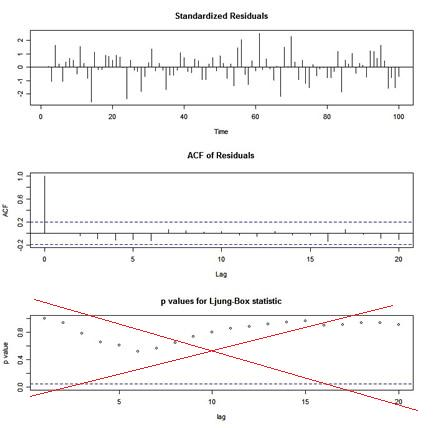

# &#128018;&#128018; R you kidding &#128018;&#128018;


### Table of Contents
  * [R Time Series Issues is back](#hello-you)
    * [Issue 1. when is a matrix not a matrix](#issue-1---when-is-a-matrix-not-a-matrix)
    * [Issue 2. package fights](#issue-2---how-will-r-end)
    * [Issue 3. artificially stupid intelligence](#issue-3---dont-use-autoarima)
    * [Issue 4. when is the intercept the mean](#issue-4---when-is-the-intercept-the-mean)
    * [Issue 5. R you drifting?](#issue-5---your-arima-is-drifting)
    * [Issue 6. wrong p-values](#issue-6---the-wrong-p-values)
    * [Issue 7. lead from behind](#issue-7---lead-from-behind)


### Hello You 

$x^2+y^2=13$

We're back at trying to help You get past the gnarly stuff that comes with trying to use R for time series. This is an update of the [R Issues Page](https://www.stat.pitt.edu/stoffer/tsa4/Rissues.htm) wherein it is written, on whatever they write it on up there: 


> There are a few items related to the analysis of time series with R that will have you scratching your head. The issues mentioned below are meant to help get you past the sticky points. 

Many of these issues have been taken care of in  the package [astsa](https://github.com/nickpoison/astsa).  An introduction to the package may be found at
[FUN WITH ASTSA](https://github.com/nickpoison/astsa/blob/master/fun_with_astsa/fun_with_astsa.md) where the fun never stops.  &#x1F388; &#x1F388; &#x1F388;

<br/><br/>


---

###  ISSUE 1 - when is a matRix not a matRix? 

---

 You have a time series of matrices, say _A<sub>t</sub>_ that are of arbitrary dimensions _p x q_ for _t = 1, &#8230; , n_.  You would use an `array` right?  BUT, and this is a big BUT, the behavior changes with _p_ and _q_.  Let's have a closer look: 

```r
# 3  2x2 matrices
( A = array(diag(1,2), dim=c(2, 2, 3)) )
##   , , 1
##   
##        [,1] [,2]
##   [1,]    1    0
##   [2,]    0    1
##   
##   , , 2
##   
##        [,1] [,2]
##   [1,]    1    0
##   [2,]    0    1
##   
##   , , 3
##   
##        [,1] [,2]
##   [1,]    1    0
##   [2,]    0    1

is.matrix(A[,,2])
  [1] TRUE  ok - a matrix


# 3  2x1 matrices 
( B = array(matrix(1,2), dim=c(2, 1, 3)) )
##   , , 1
##   
##        [,1]
##   [1,]    1
##   [2,]    1
##   
##   , , 2
##   
##        [,1]
##   [1,]    1
##   [2,]    1
##   
##   , , 3
##   
##        [,1]
##   [1,]    1
##   [2,]    1

is.matrix(B[,,2])
  [1] FALSE  WTF? not a matrix
  

# 3  1x2 matrices 
( C = array(matrix(2,1), dim=c(1, 2, 3)) )
##  , , 1
##  
##       [,1] [,2]
##  [1,]    2    2
##  
##  , , 2
##  
##       [,1] [,2]
##  [1,]    2    2
##  
##  , , 3
##  
##       [,1] [,2]
##  [1,]    2    2

is.matrix(C[,,2])
  [1] FALSE  WTF? not a matrix
```

What's happening is if _p_ or _q_ are 1, then you don't get an array of matrices.
What can go wrong?

```r 
# should be a 2x1 times a 1x2 or 2x2 - BUT IT'S NOT!
B[,,1]%*%C[,,1]
#       [,1]
# [1,]    4

# this doesn't work either
as.matrix(B[,,1])%*%as.matrix(C[,,1])
# Error in as.matrix(B[, , 1]) %*% as.matrix(C[, , 1]) : 
#  non-conformable arguments
```
What's the remedy? Use Matlab, or make sure your matrices are the matrices you intended them to be:

```r
# like this
 matrix(B[,,1], 2, 1)%*%matrix(C[,,1], 1, 2)
#      [,1] [,2]
# [1,]    2    2
# [2,]    2    2
```

 &#128545; If you're thinking "Well don't use `array` if one of the dimensions is 1.", let me remind you that the dimensions are arbitrary... meaning if you write a general script, you have to have cases.

Now back to our regularly scheduled list of screw ups.

[<sub>top</sub>](#table-of-contents)

<br/>

---

### Issue 2 - how will R end?  

---

 The issue below has become a real pain as  the commercial enterprise that makes RStudio  influences the R Foundation, which is a nonprofit organization.  Older folks saw this happen with R's predecessor, S-PLUS.  Anybody using S-PLUS right now?
  
 
An   issue with a conflict between the package  `dplyr`  and  `stats`  package  came to my attention recently; in particular `filter()` and `lag()`. There may be more but the conflict can ruin you analyses.

 The bottom line is, if you are working with time
    series and you load  `dplyr`, then you should know what it breaks... just be careful.
	

In fact, you should be careful whenever you load a package.  For example:
```r
# if I do this
library(dplyr)

# I will see this 
 Attaching package: 'dplyr' 

 The following objects are masked from 'package:stats': 

     filter, lag     

 The following objects are masked from 'package:base': 

     intersect, setdiff, setequal, union      

## it's a package fight!   
```
To be safe, load packages consciously and watch for masked objects warnings.  I would say avoid loading `dplyr` if
you're analyzing time series interactively (the advantage of using R vs batch mode programs). 

 
One fix if you're analyzing time series (or teaching a class) is to (tell students to) do the following after loading all the packages needed: 
```r
filter = stats::filter
lag = stats::lag
```

>&#128260; Oh yeah, so you're probably wondering how? ... every package will nullify every other package until one day, you load R and it masks itself in an infinite do loop ...

[<sub>top</sub>](#table-of-contents)

<br/>


---

### Issue 3 - don't use auto.arima   

---

 Don't use black boxes like `auto.arima` from the `forecast` package because IT DOESN'T WORK; see [Using an automated process to select the order of an ARMA time series model returns the true data generating process less than half the time even with simple data generating processes; and with more complex models the chance of success comes down nearly to zero even with long sample sizes.](http://freerangestats.info/blog/2015/09/30/autoarima-success-rates)


 Originally, `astsa` had a version of automatic fitting of models but IT DIDN'T WORK and was scrapped.  The bottom line is, if you don't know what you're doing, then why are you doing it? Maybe a better idea is to [take a short course on fitting ARIMA models to data](https://www.datacamp.com/courses/arima-models-in-r).

&#128055; DON'T BELIEVE IT?? OK... HERE YOU GO:

```r
set.seed(666)
x = rnorm(1000)          # WHITE NOISE
forecast::auto.arima(x)  # BLACK BOX

   # partial output
     Series: x
     ARIMA(2,0,1) with zero mean

     Coefficients:
               ar1      ar2     ma1
           -0.9744  -0.0477  0.9509
     s.e.   0.0429   0.0321  0.0294

     sigma^2 estimated as 0.9657:  log likelihood=-1400
     AIC=2808.01   AICc=2808.05   BIC=2827.64
```

 HA! ... an ARMA(2,1) ??  
 
&#128038; There are lots of examples.  The bottom line here is, automated ARIMA model fitting is for the birds. 

[<sub>top</sub>](#table-of-contents)

<br/>


---

### Issue 4 - when is the intercept the mean?   

---


 When fitting ARIMA models, R calls the estimate of the mean, the estimate of the intercept. This is ok if there's no AR term, but not if there is an AR term.

For example, if x(t) = &alpha; + &phi; x(t-1) + w(t) is stationary, then taking expectations we have &mu; = &alpha; + &phi; &mu; or 

&emsp; &emsp; &alpha; = &mu; (1-&phi;).


 So, the intercept, &alpha;  is not the mean, &mu;, unless &phi; = 0. In general, the mean and the intercept are the same only when there is no AR term. Here's a numerical example:

```r
# generate an AR(1) with mean 50
set.seed(666)      # so you can reproduce these results
x = arima.sim(list(order=c(1,0,0), ar=.9), n=100) + 50 

mean(x)  
  [1] 49.09817   # the sample mean is close

arima(x, order = c(1, 0, 0))  
  Coefficients:
           ar1  intercept   # <--  here is the problem
        0.7476    49.1451   # <--  or here, one of these has to change
  s.e.  0.0651     0.3986
```

The result is telling you the estimated model is something like

&emsp; &emsp;  x(t) = 49 + .75 x(t-1) + w(t)

whereas, it should be telling you the estimated model is

 &emsp; &emsp; x(t) - 49 = .75 [ x(t-1) - 49 ] + w(t) 

or

 &emsp; &emsp;  x(t) = 12.25 + .75 x(t-1) + w(t)
  
&#129300; And if 12.25 is not the intercept, then what is it??

The easy thing (for the R devs) to do is simply change "intercept" to "mean":

```r
  Coefficients:
           ar1       mean  # <-- easy  
        0.7476    49.1451
  s.e.  0.0651     0.3986
 ``` 

 This is the main reason `sarima` in the package [`astsa`](https://github.com/nickpoison/astsa) was developed, and frankly, to make up for the fact that time series was an after thought, started the entire [`astsa`](https://github.com/nickpoison/astsa) package in the first place.

[<sub>top</sub>](#table-of-contents)

 <br/>

 

---

### Issue 5 - your arima is drifting 

---


 When fitting ARIMA models with R, a constant term is NOT included
in the model if there is any differencing. The best R will do by default
is fit a mean if there is no differencing [type `?arima` for details].

What's wrong with this?  Well (with a time series in `x`), for example:
```r
arima(x, order = c(1, 1, 0))          # (1)
```
will not produce the same result as
```r
arima(diff(x), order = c(1, 0, 0))    # (2)
``` 
because in (1), R will fit the model [with &nabla;x(s) = x(s)-x(s-1)]

&emsp; &emsp;  &nabla; x(t)= &phi; &nabla; x(t-1) + w(t) &nbsp;&nbsp;(no constant) 

whereas in (2), R will fit the model 

&emsp; &emsp; &nabla;x(t) = &alpha; + &phi; &nabla;x(t-1) + w(t). &nbsp;&nbsp;(constant)<br/>

If there's drift (i.e., &alpha; is NOT zero), the two fits can be extremely different
and using (1) will lead to an incorrect fit and consequently bad forecasts. 

If  &alpha;  is NOT zero, then what you have to do to correct (1) is use xreg as follows:

```r
arima(x, order = c(1, 1, 0), xreg=1:length(x))    # (1+)
```


If you want to see the differences, generate a random walk with drift and
try to fit an ARIMA(1,1,0) model to it.  Here's how:

```r
set.seed(1)           # so you can reproduce the results
v = rnorm(100,1,1)    # v contains 100 iid N(1,1) variates
x = cumsum(v)         # x is a random walk with drift = 1 

## (1)
arima(x, order = c(1, 1, 0))   # yes! it's a mess!  
#  Coefficients:
#           ar1
#        0.6031
#  s.e.  0.0793

## (2)
arima(diff(x), order = c(1, 0, 0))   
#  Coefficients:
#            ar1  intercept
#        -0.0031     1.1163
#  s.e.   0.1002     0.0897

## (1+)
arima(x, order = c(1, 1, 0), xreg=1:length(x))     
#  Coefficients:
#            ar1  1:length(x)
#        -0.0031       1.1163
#  s.e.   0.1002       0.0897
```

 Let me explain what's going on here. The model generating the data is  

&emsp;&emsp; x(t) = 1 + x(t-1) + w(t) 

where w(t) is N(0,1) noise.  Another way to write this is 


&emsp;&emsp;   [x(t)-x(t-1)] = 1 + 0 [x(t-1)-x(t-2)] + w(t) 
 
or

&emsp;&emsp;  &nabla;x(t) = 1 + 0 &nabla;x(t-1) + w(t) 
  

so, if you fit an AR(1) to x(t), the estimates should be, approximately, `ar1 = 0` 
and `intercept = 1`.  
     
So (1) gives the WRONG answer because it's forcing the regression through the origin. The
others are correct.


Why does (1+) work?  In symbols,   xreg = t  and consequently, 
 R will replace  x(t)   with  y(t) = x(t) - &beta; t  ;
that is, it will fit the model

&nbsp;   &nabla;y(t)=   &phi; &nabla;y(t-1) + w(t),

or

&nbsp;   &nabla;[x(t) - &beta; t] =   &phi; &nabla;[x(t-1) - &beta; (t-1)] + w(t). 

Simplifying, 

&nbsp;  &nabla;x(t) = &alpha; +  &phi; &nabla;x(t-1) + w(t)  

where    &alpha; =  &beta; (1-&phi;).

&#128054;  S-PLUS didn't address the possibility that a time series would have drift.  The R folks continued that mistake (mistakes propagate) because signal processing was an after-thought in S-PLUS that propagated to R.  

The bottom line here is, if you wanna be happy for the rest of your life, don't use vanilla R scripts to do time series analysis.  Instead, reach for a package like [astsa](https://github.com/nickpoison/astsa)  that will set you free.


[<sub>top</sub>](#table-of-contents)

<br/>


---

### Issue 6 - the wrong p-values 

---

 If you use `tsdiag` for diagnostics after an ARIMA fit, you will
get a graphic that looks like this: 




 The p-values shown for the Ljung-Box statistic plot are incorrect because the degrees
of freedom used to calculate the p-values are `lag` instead of `lag - (p+q)`.
That is, the procedure being used does NOT take into account the fact that the residuals are
from a fitted model.  This is corrected in `sarima` in  [`astsa`](https://github.com/nickpoison/astsa).

[<sub>top</sub>](#table-of-contents)

<br/>


---

### Issue 7 - lead from behind 

---


 You have to be  careful when working with lagged components of a time
series. 
Note that `lag(x)` is a FORWARD shift and `lag(x,-1)`  is a BACKWARD shift
(unless you happen to load `dplyr`).


Try a small example:

```r
x = ts(1:5)
cbind(x, lag(x), lag(x,-1))
 
  Time Series:
  Start = 0 
  End = 6 
  Frequency = 1 
  
      x lag(x) lag(x, -1)
  0  NA     1         NA
  1   1     2         NA
  2   2     3          1
  3   3     4          2 ## in this row, x is 3, lag(x) is 4, lag(x,-1) is 2
  4   4     5          3               
  5   5    NA          4
  6  NA    NA          5
```

In other words,  if you have a series x(t) then 

&emsp;  y(t) = lag{x(t)} = x(t+1) 

 and NOT  x(t-1).  In fact, this is reasonable in that y(t) actually does "lag" x(t) by one time period. But, it seems awkward, and it's not typical of other programs. As long as you know the convention, you'll be ok (unless you happen to load `dplyr`).

 
 [<sub>top</sub>](#table-of-contents)
 
 
 <br/>


 