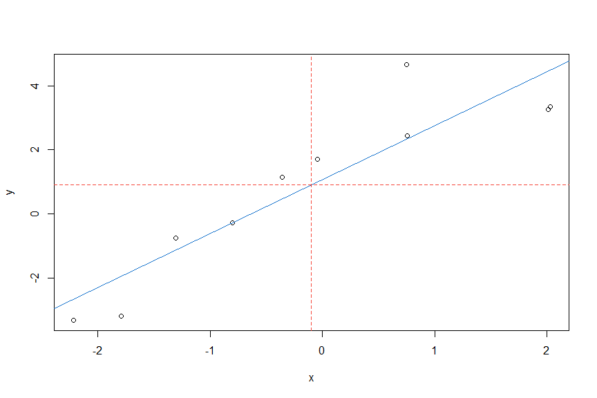

## Time Series Analysis and Its Applications: With R Examples (R Supplement)

---
### Installing R

 
R is an open source programming language and software environment for statistical computing and graphics
that runs on many operating systems. It is an interpreted language and is 
accessed  through a command-line interpreter.  A user types a command, presses enter,
and the answer is returned.  
 

To obtain  R,
 point your browser to the Comprehensive R Archive Network ([CRAN](http://cran.r-project.org/)) and download and install it.
The installation includes help files and some user   manuals. 
An internet search  can pull up various short tutorials and  videos,
for example, [R Cookbook](https://rc2e.com/), 
[Hand-On Programming with R](https://rstudio-education.github.io/hopr/)
 and the website
[Quick-R](https://www.statmethods.net/r-tutorial/index.html).
And we state the obvious:

 > &nbsp;&nbsp;&nbsp;  _If you can't figure out how to do something, do an internet search_.

 
[RStudio](https://posit.co/downloads/) can make using  R   easier and we recommend using it for course work.
  It  is an  open source integrated development environment (IDE) for R. 
  It includes a console, syntax-highlighting editor that supports direct code execution, as well as tools for plotting, history, debugging, and workspace management.     
 This tutorial does not assume you are using RStudio;  if you do use it, a number of the command-driven tasks
 can be accomplished by pointing and clicking.

 
There are some simple exercises in this appendix that will help you get used to using \R. For example,

- __Exercise:__ Install R and RS (optional) now.  
- _Solution:_ Follow the directions above.

---
### Packages and ASTSA 
 

At this point, you should have R (or RStudio) up and running.
The capabilities of R are extended through packages. R comes with 
a number of preloaded packages that are available immediately.
There are base packages that install with R and load automatically.
Then there are priority packages that are installed with R but not loaded
automatically.  Finally, there are  user-created packages that must be installed
and loaded into R before use.
If you are using RStudio, there is a _Packages_ tab to help you manage your packages.


Most packages can be obtained from CRAN and its mirrors.  _The package used extensively in the text is `astsa` (Applied Statistical Time Series Analysis)_.  If you are using RStudio, then use  _Install_ from the _Packages_ tab.  If asked to choose a repository, select _0-Cloud_, the first choice, and that
will find your closest repository. Get it now:

- __Exercise:__ Install  `astsa` 
- _Solution:_ Issue the command: `install.packages('astsa')` 


 The latest version of `astsa`  will  always be   available from GitHub.
 More information may be found at [GitHub](https://github.com/nickpoison/astsa/blob/master/NEWS.md). 


To use a package you have to load it
after starting R, for example:
```r
library(astsa)
```
If you don't use RStudio,  you may want to create a `.First` function as follows, 
```r
.First <- function(){library(astsa)}
```
and save the workspace when you quit, then `astsa` will be loaded at every start.
If you use RStudio, just tick the `astsa` box in the _Packages_ tab.


We will use the `xts` package and the `zoo` package throughout the text. 
To  install both,  start R and type
```r
install.packages("xts")  # installs both xts and zoo
```
And again, to use the package    you must load it first by issuing the command 
```r
library(xts)
``` 
This is a good time to get those packages: 

- __Exercise:__ Install and then load `xts` and consequently  `zoo`.
- _Solution:_ Follow the directions above.

 
---
### Getting Help

R is not consistent with help files across different operating systems.
In RStudio, there is a _Help_ tab. Otherwise,
the  R html help system can be started by issuing the command 
```r
help.start()
```
The help files for installed packages can also be found there.  {\em Notice
the parentheses} in all the commands above; they are necessary to run scripts. If you simply type
```r
help.start     
```
nothing will happen and 
you will just see the commands that make up the script. 
To get help for a particular command, say `library`, 
do this:
```r
help(library) 
?library        # same thing    
```

- __Exercise:__  Load `astsa` and examine its help files.
- _Solution:_  `library(astsa)` ;  `?astsa`

Notice the use of a semicolon for multiple commands on one line


---
### Basics

The convention throughout the text is that
  R code is in <font color="blue"> blue </font>  with <font color="red"> red </font> operators, output is
<font color="purple">  purple </font>, and comments are <font color="green">green</font>.   Get comfortable, start R and try some simple tasks.
```r
2+2           # addition 
 [1] 5
5*5 + 2       # multiplication and addition 
 [1] 27
5/5 - 3       # division and subtraction 
 [1] -2
log(exp(pi))  # log, exponential, pi 
 [1] 3.141593
sin(pi/2)     # sinusoids
 [1] 1
2^(-2)        # power
 [1] 0.25 
sqrt(8)       # square root
 [1] 2.828427
-1:5           # sequences
 [1] -1  0  1  2  3  4  5
seq(1, 10, by=2)   # sequences 
 [1] 1 3 5 7 9
rep(2, 3)     # repeat 2 three times
 [1] 2 2 2
``` 

- __Exercise:__  Explain what you get if you do this: `(1:20/10) %% 1`
- _Solution:_  Yes, there are a bunch of numbers that look like what
is below, but explain why those are the numbers that were produced.
Hint:  `help("%%")`  
```r 
  [1] 0.1 0.2 0.3 0.4 0.5 0.6 0.7 0.8 0.9 0.0
 [11] 0.1 0.2 0.3 0.4 0.5 0.6 0.7 0.8 0.9 0.0 
```

- __Exercise:__ Verify that $1/i = -i$ where $i = \sqrt{-1}$.
- _Solution:_  The complex number $i$ is written as `1i` in R.

```r
1/1i  
 [1] 0-1i    # complex numbers are displayed as a+bi
```

- __Exercise:__  Calculate $e^{i \pi}$.
- _Solution:_  `exp(1i*pi)`

Extra credit: $e^{i \pi} + 1 =0$ is a famous formula that uses 
the five most basic values in mathematics.  What name is associated
with this awesome equation? 


- __Exercise:__  Calculate these four numbers:
 $\cos(\pi/2),\, \cos(\pi),\, \cos(3\pi/2),\, \cos(2\pi) $
- _Solution:_   One of the advantages of R is you can do many things in one line. So
 rather than doing this in four separate evaluations, consider using a sequence such 
 as `cos(pi*1:4/2)`.
Notice that you don't always get zero (0) where you should, 
but you will get something close to zero.    Here 
you'll see what it looks like.

---
### Objects and Assignment

Next,  we'll use  assignment to make some  objects: 
```r
x <- 1 + 2  # put 1 + 2 in object x
x = 1 + 2   # same as above with fewer keystrokes
1 + 2 -> x  # same
x           # view object x
 [1]  3
(y = 9 * 3)   # put 9 times 3 in y and view the result 
 [1] 27
(z = rnorm(5))  # put 5 standard normals into z and print z
 [1]  0.96607946  1.98135811 -0.06064527  0.31028473  0.02046853
```

Vectors can be of various types, and they can be put together using
`c()` [concatenate or combine]; for example
```r
x <- c(1, 2, 3)             # numeric vector
y <- c("one","two","three") # character vector
z <- c(TRUE, TRUE, FALSE)   # logical vector
```

 Missing values are represented by the symbol `NA`, $\infty$ by `Inf` and
 impossible values  are `NaN`.
Here are some examples:
```r
( x = c(0, 1, NA) )
 [1]  0  1 NA  
2*x
 [1]  0  2 NA  
is.na(x)
 [1] FALSE FALSE  TRUE  
x/0 
 [1] NaN Inf  NA  
```

There is a difference between `<-` and `=`.  From R  `help(assignOps)`,
you will find: _The operator `<-` can be used anywhere, whereas the operator `=` is only allowed at the top level \dots\ ._

- __Exercise:__  What is the difference between these two lines?
```r
x = 0 = y
x <- 0 -> y
```
- _Solution:_ Try them and discover what is in `x` and `y`. 


It is worth pointing out R's _recycling rule_ for doing arithmetic.
 Note again the use of the semicolon for multiple commands on one line. 
```r
x = c(1, 2, 3, 4); y = c(2, 4); z = c(8, 3, 2)
x * y    
 [1]  2  8  6 16 
y + z    # oops
 [1] 10  7  4 
Warning message:
In y + z : longer object length is not a multiple of shorter object length
```

- __Exercise:__  Why was `y+z` above the vector (10, 7, 4) and why is there a warning?
- _Solution:_ `y + z = (2+8=10, 4+3=7, 2+2=4)`.  `y` is being recycled
but not fully.   This type of calculation is usually done in error.
 


 The following  commands are useful:
```r 
ls()                # list all objects
 "dummy" "mydata" "x" "y" "z"
ls(pattern = "my")  # list every object that contains "my" 
 "dummy" "mydata"
rm(dummy)           # remove object "dummy"
rm(list=ls())       # remove almost everything (use with caution)
data()              # list of available data sets
help(ls)            # specific help (?ls is the same)
getwd()             # get working directory
setwd()             # change working directory
q()                 # end the session (keep reading)
```
and a [reference card may be found here](https://cran.r-project.org/doc/contrib/Short-refcard.pdf).
  When you quit, R will prompt you to save an image of your current workspace.
Answering _yes_ will  save   the work  you have done so far, and load it   when you next start R. We have never regretted selecting _yes_, but we 
 have regretted answering _no_.


If you want to __keep your files separated for different projects__, then having to set the working directory each time you run  R  is a pain.  If you use RStudio, then you can easily [create separate projects](https://support.posit.co/hc/en-us/articles/200526207).  There are some easy work-arounds, but it depends on your OS.  In Windows, copy the R or RStudio shortcut into the directory you want to use for your project. Right click on the shortcut icon, select _Properties_, and remove the text in the _Start in:_ field; leave it blank and press _OK_.  Then start R or RStudio from that shortcut.  


- __Exercise:__  Create a directory that you will use for the course and 
use the tricks previously mentioned to make it your working directory (or use the default if
you   do not care). Load `astsa` and use help to find out what is in the data file `cpg`. Write `cpg` as text to your working directory.
- _Solution:_  Assuming you started R\in the working directory:
```r
library(astsa)
help(cpg)     # or ?cpg
  Median annual cost per gigabyte (GB) of storage. 
write(cpg, file="cpg.txt", ncolumns=1)   
```


- __Exercise:__ Find the file {\ttt cpg.txt} previously created (leave it there for now).\\
- _Solution:_  In \RS, use the {\sf Files} tab. Otherwise, go to your working directory: 
```r
getwd()
 "C:\TimeSeries"  
```
Now find the file and  look at it; there should be 29 numbers in one column.


To create your own data set, you can make a data vector
as follows:
```r
mydata = c(1,2,3,2,1)
```

Now you have an object called `mydata` that contains five elements.  R calls these objects `vectors` even though they have no dimensions (no rows, no columns); they do  have order and length:
```r
mydata         # display the data 
 [1] 1 2 3 2 1
mydata[3:5]    # elements three through five 
 [1] 3 2 1
mydata[-(1:2)] # everything except the first two elements
 [1] 3 2 1
length(mydata) # number of elements
 [1] 5
scale(mydata)  # standardize the vector of observations
            [,1]
 [1,] -0.9561829
 [2,]  0.2390457
 [3,]  1.4342743
 [4,]  0.2390457
 [5,] -0.9561829
 attr(,"scaled:center")
 [1] 1.8
 attr(,"scaled:scale")
 [1] 0.83666 
dim(mydata)    # no dimensions
 NULL
mydata = as.matrix(mydata)  # make it a matrix
dim(mydata)    # now it has dimensions
 [1] 5 1
```


If you have an external data set, you can use {\ssf scan} or
{\ssf read.table} (or some variant) to input the data.
For example, suppose you have an {\sc ascii} (text) data file called {\ssf dummy.txt}
in your working directory,
%in a directory called {\ssf TimeSeries} \label{getwd2} in your root directory,
and the file looks like this:


| 1 | 2 | 3 | 2 | 1 |
|---|---|---|---|---|
| 9 | 0 | 2 | 1 | 0 |


 ```r
(dummy = scan("dummy.txt") )        # scan and view it
 Read 10 items
  [1] 1 2 3 2 1 9 0 2 1 0
(dummy = read.table("dummy.txt") )  # read and view it 
 V1 V2 V3 V4 V5
  1  2  3  2  1
  9  0  2  1  0
``` 
There is a difference between `scan` and `read.table`.
The former produced a data vector of 10 items while the latter
produced a _data frame_ with names `V1` to `V5` and two observations
per variate. 


- __Exercise:__ Scan and view  the data in the file `cpg.txt` that you previously created. 
- _Solution:_ Hopefully it's in your working directory:
```r
(cost_per_gig = scan("cpg.txt") )  # read and view
 Read 29 items
 [1] 2.13e+05 2.95e+05 2.60e+05 1.75e+05 1.60e+05
 [6] 7.10e+04 6.00e+04 3.00e+04 3.60e+04 9.00e+03
[11] 7.00e+03 4.00e+03 ... 
``` 


When you use `read.table` or similar, you create a data frame.
In this case, if you want to list (or use) the second
variate, `V2``, you could use
 ```r 
dummy$V2
 [1] 2 0
```
and so on. You might want to look at the help files `?scan` and `?read.table` now.
Data frames (`?data.frame`) are _used as the fundamental data structure by most of R's modeling software._
Notice that R gave the columns of `dummy`  generic names, `V1,..., V5`.  You can provide your own names and then use  the names to access the data without the use of `$` as   above.
 ```r 
colnames(dummy) = c("Dog", "Cat", "Rat", "Pig", "Man")
attach(dummy)    # this can cause problems; see ?attach
Cat 
 [1] 2 0 
Rat*(Pig - Man)  # animal arithmetic  
 [1] 3 2 
head(dummy)      # view the first few lines of a data file
detach(dummy)    # clean up  
```

R is case sensitive, thus `cat` and `Cat` are different.  Also, `cat` is a reserved name (`?cat`)
in R, so using `cat` instead of `Cat` may  cause problems later.
It is noted that `attach` can lead to confusion: _The possibilities for creating errors when using attach are numerous. Avoid._  If you use it, it is best to clean it up when you are done.

You can also use `save` and `load` to work with R compressed data files if you have large files. If interested, investigate the use of the `save` and `load`` commands. The best way to do this is to do an internet search on _R save and load_, but you knew this already.


You may also include a _header_ in the data file to avoid `colnames`. For example, if you have a _comma separated values_ file `dummy.csv`   that looks like this,
 
|Dog,Cat,Rat,Pig,Man|
|:-----------------|
|1, 2, 3, 2, 1|   
|9, 0, 2, 1, 0| 

then use the following command to read the data.
 ```r 
(dummy = read.csv("dummy.csv")) 
    Dog Cat Rat Pig Man
  1   1   2   3   2   1
  2   9   0   2   1   0
``` 
  
The default for `.csv` files is `header=TRUE`, type  `?read.table` for further information
  on similar types of files.
 

Two commands that are used frequently to manipulate data are `cbind` for _column binding_
and `rbind` for _row binding_. The following is an example.

```r
options(digits=2)  # significant digits to print - default is 7
x = runif(4)       # generate 4 values from uniform(0,1) into object x
y = runif(4)       # generate 4 more and put them into object y
cbind(x,y)         # column bind the two vectors (4 by 2 matrix) 
          x    y
  [1,] 0.90 0.72
  [2,] 0.71 0.34
  [3,] 0.94 0.90
  [4,] 0.55 0.95

rbind(x,y)         # row bind the two vectors (2 by 4 matrix)
    [,1] [,2] [,3] [,4]
  x 0.90 0.71 0.94 0.55
  y 0.72 0.34 0.90 0.95
```

- __Exercise:__ Make two vectors, say `a` with odd numbers  and `b` with even numbers between
1 and 10.  Then, use `cbind` to make a matrix,  `x` from  `a` and `b`.
After that, display each column of `x` separately.
- _Solution_ 
```r
a = seq(1, 10, by=2)
b = seq(2, 10, by=2)
x = cbind(a, b)
x[,1]
 [1] 1 3 5 7 9 
x[,2]
 [1]  2  4  6  8 10 
```


Summary statistics of a data set are fairly easy to obtain.  We will 
simulate 25 normals with $\mu=10$ and $\sigma=4$ and then perform some basic analyses.
The first line of the code is `set.seed`, which fixes the seed for the generation of
 pseudorandom  numbers. Using the same seed yields the same results; to expect anything else would be insanity.
```r
options(digits=3)       # output control 
set.seed(911)           # so you can reproduce these results
x = rnorm(25, 10, 4)    # generate the data
c( mean(x), median(x), var(x), sd(x) )  # guess
 [1] 11.35 11.47 19.07  4.37
c( min(x), max(x) )     # smallest and largest values
 [1] 4.46 21.36 
which.max(x)            # index of the max (x[20] in this case) 
 [1] 20 
boxplot(x);  hist(x);  stem(x)   # visual summaries (not shown)
```


- __Exercise:__ Generate 100 standard normals and draw a boxplot of the results
when there are at least two displayed ``outliers'' (keep trying until you get at least two).
- _Solution_ Even without cheating, it will not take long to complete:
```r
set.seed(911)        # you can cheat -or-
boxplot(rnorm(100))  # reissue until you see at least 2 outliers
```


It can't hurt to learn a little about programming in R because you will see some of it along the way.
First, let's try a simple example of a function that returns the reciprocal of a number:
```r
oneover <- function(x){ 1/x }
oneover(0)
 [1] Inf 
oneover(-4)
 [1] -0.25      
``` 

A script can have multiple inputs, for example, guess what this does:
```r
xtimesy <- function(x,y){ x * y }    
xtimesy(20, .5)  # and try it
  [1] 10 
``` 

- __Exercise:__  Write a simple function to return, for numbers 
`x` and `y`, the first input raised to the power of the second input,
and then use it to find the square root of 25.
- _Solution:_ It's similar to the previous example.
```r
pwr <- function(x, y){ x^y }
pwr(25, .5)
  [1] 5  
```


---
### Regression and Time Series Primer

These topics run throughout the text, but we will give a brief introduction here.
The workhorse for linear regression in R is `lm()`.  Suppose we want to fit a simple linear regression,
$y = \alpha + \beta x + \epsilon$.  In R, the formula is written as `y~x`. Let's simulate some data and do a simple example first.

```r
set.seed(666)           
x = rnorm(10)           # generate 10 standard normals  
y = 1 + 2*x + rnorm(10) # generate a simple linear model
summary(fit <- lm(y~x)) # fit the model - summarize results
   Coefficients:
              Estimate Std. Error t value Pr(>|t|)    
  (Intercept)   1.0680     0.3741   2.855 0.021315    
  x             1.6778     0.2651   6.330 0.000225  
  ---
  Residual standard error: 1.18 on 8 degrees of freedom
  Multiple R-squared:  0.8336,    Adjusted R-squared:  0.8128 
  F-statistic: 40.07 on 1 and 8 DF,  p-value: 0.0002254
plot(x, y)              # scatterplot of data (see below)
abline(fit, col=4)      # add fitted blue line (col 4) to the plot  
```

Note that we put the results  into an 
 object we called `fit`; this object contains 
 all of the information about the  regression.
  Then we used `summary` to display some of the results
  and used `abline` to plot the fitted line.
The command `abline` is useful for drawing horizontal and vertical lines also.

 - __Exercise:__ Add    red horizontal and vertical dashed lines
to the previously generated graph to show that the fitted line goes through
the point $(\bar x, \bar y)$.
- _Solution:_  Add the following line to the above code:
```r 
abline(v=mean(x), h=mean(y), col=2, lty=2)  # col 2 is red and lty 2 is dashed
```


<br/>


The `lm`} object that we called `fit` in  our simulation contains all sorts of information that
can be extracted.  Sometimes, however, it might be difficult to find where that information is stored.
The easiest way to find what is stored in an object is to look at the _structure_ of the object.  We list only a partial output because this particular list is very long.
```r
str(fit)     # partial listing below
  List of 12
   $ coefficients : Named num [1:2] 1.07 1.68
    ..- attr(*, "names")= chr [1:2] "(Intercept)" "x"
   $ residuals    : Named num [1:10] 2.325 -1.189 0.682 -1.135 -0.648 ...
    ..- attr(*, "names")= chr [1:10] "1" "2" "3" "4" ...
   $ fitted.values: Named num [1:10] 2.332 4.448 0.472 4.471 -2.651 ...
    ..- attr(*, "names")= chr [1:10] "1" "2" "3" "4" ...
```

For example, the parameter estimates are in `fit$coef` or `coef(fit)`. We can get the residuals from `fit$resid` or `resid(fit)` and the commands `fit$fitted` or `fitted(fit)` will display the fitted values.  For example, we may be interested in plotting the residuals in order or in  plotting the residuals against the fitted values:

```r 
plot(resid(fit))              # not shown
plot(fitted(fit), resid(fit)) # not shown
```


Let's  focus a little on time series. To create a time series object, use the command `ts`.  Related commands are `as.ts` to coerce an object to a time series  and `is.ts` to test whether an object is a time series.  First, make a small data set:
```r
(mydata = c(1,2,3,2,1) ) # make it and view it
  [1] 1 2 3 2 1
```

Make it an annual time series that starts in 2020:

```r 
(mydata = ts(mydata, start=2020) )
  Time Series:
  Start = 2020
  End = 2024
  Frequency = 1
  [1] 1 2 3 2 1 
```

Now make it a quarterly time series that starts in 2020-III:
```r 
(mydata = ts(mydata, start=c(2020,3), frequency=4) )
       Qtr1 Qtr2 Qtr3 Qtr4
  2020              1    2
  2021    3    2    1     

time(mydata)  # view the dates  
          Qtr1    Qtr2    Qtr3    Qtr4 
  2020                 2020.50 2020.75
  2021 2021.00 2021.25 2021.50 
```

To use part of a time series object,  use `window()`:
```r

(x = window(mydata, start=c(2021,1), end=c(2021,3)) )
       Qtr1 Qtr2 Qtr3
  2021    3    2    1
```

Next, we'll look at lagging and differencing, which are fundamental transformations used frequently in the analysis of time series. For example, if I'm interested in predicting todays from yesterdays, I would look at the relationship between $x_t$ and its lag, $x_{t-1}$. First make a simple series, $x_t$:

> _WARNING_ If the R package `dplyr` is attached or `tidyverse` is loaded, then
`lag` has been corrupted. In this case, use the command `filter = stats::filter` before analyzing time series in R.

```r
x = ts(1:5)
```

Now, column bind (`cbind`) lagged values of $x_t$ and you will notice that `lag(x)`` is _forward_ lag, whereas `lag(x, -1)` is _backward_ lag.
```r
cbind(x, lag(x), lag(x,-1))
       x   lag(x)   lag(x, -1)
  0   NA      1        NA
  1    1      2        NA
  2    2      3         1
  3    3      4         2  <- # in this row, for example, x is 3, 
  4    4      5         3     #  lag(x) is ahead at 4, and  
  5    5     NA         4     #   lag(x,-1) is behind at 2  
  6   NA     NA         5 
``` 

Compare `cbind` and `ts.intersect`:

```r
ts.intersect(x, lag(x,1), lag(x,-1)) 
  Time Series:  Start = 2  End = 4  Frequency = 1
      x   lag(x, 1)   lag(x, -1)
  2   2         3          1
  3   3         4          2
  4   4         5          3
```

To examine the time series attributes of an object, use `tsp`.  For example, one of the time series in `astsa` is the US unemployment rate:

```r
tsp(UnempRate)
 [1] 1948.000 2016.833   12.000
#    start    end        frequency
```

which starts January 1948, ends in November 2016 (10/12 &approx; .833), and
is monthly data (frequency = 12).


For discrete-time series, finite 
 differences are used like differentials. 
To  difference a series, $\nabla x_t = x_t - x_{t-1}$, use
```r
diff(x)    
```
but note that
```r 
diff(x, 2)    
```
is $x_t - x_{t-2}$ and {\it not} second order differencing. For second-order differencing, that is, $\nabla^2 x_t = \nabla (\nabla x_t)$, do one of these:
```r
diff(diff(x))    
diff(x, diff=2)   # same thing
```
and so on for higher-order differencing.


You have to be careful if you  use {\ttt lm()} for lagged values of a time series.
 If you use {\ssf lm()}, then
what you have to do is align the series 
using {\ssf ts.intersect}.    Please read the warning {\em Using time series} in the
{\ssf lm()} help file [{\ssf help(lm)}]. Here is an example regressing {\ttt astsa} data,
weekly cardiovascular
mortality ($M_t$ {\ssf cmort}) on particulate pollution ($P_t$ {\ssf part})
at the present value and lagged four weeks ($P_{t-4}$ {\ttt part4}).
The model is
\[
M_t = \alpha + \beta_1 P_t + \beta_2 P_{t-4} + w_t\,,
\]
where we assume $w_t$ is the usual normal regression error term.
First, we create the data matrix   {\ttt ded}, which consists of
the intersection of the three series:
 ```r
library(astsa)   # load astsa first
ded = ts.intersect(cmort, part, part4=lag(part,-4))
```
Now the series are all aligned and the regression will work.
```r
summary(fit <- lm(cmort~part+part4, data=ded, na.action=NULL) )
 Coefficients:
             Estimate Std. Error t value Pr(>|t|)    
 (Intercept) 69.01020    1.37498  50.190  < 2e-16  
 part         0.15140    0.02898   5.225 2.56e-07  
 part4        0.26297    0.02899   9.071  < 2e-16  
 ---
 Residual standard error: 8.323 on 501 degrees of freedom
 Multiple R-squared:  0.3091,    Adjusted R-squared:  0.3063 
 F-statistic: 112.1 on 2 and 501 DF,  p-value: < 2.2e-16 
```
There was no need to rename {\ssf lag(part,-4)} to {\ssf part4},
it's just an example of what you can do.  
Also,   {\ttt na.action=NULL} is necessary to retain the time series
attributes. It should be there whenever you 
do time series regression.

\needsp{2}
\Exer Rerun the previous example of mortality on pollution but without
using {\ttt ts.intersect}.  In this case, the lagged pollution value gets
kicked out of the regression because {\ttt lm()} sees {\ttt part} and {\ttt part4} 
as the same thing.\\
\Soln First lag particulates and then put it in to the regression.
```r
part4 <- lag(part, -4)
summary(fit <- lm(cmort~ part + part4, na.action=NULL) )
 Coefficients: (1 not defined because of singularities) # ouch!
              Estimate Std. Error t value Pr(>|t|)    
  (Intercept) 74.79860    1.30943   57.12   <2e-16 
  part         0.29317    0.02631   11.14   <2e-16 
  part4             NA         NA      NA       NA 
```


\begin{soln}
It doesn't work  with or without the {\ttt na.action} statement; notice the
warning.
```r
> part4 <- lag(part, -4)
> summary(fit <- lm(cmort~part+part4, na.action=NULL) )
  Coefficients: (1 not defined because of singularities)   <- ouch
              Estimate Std. Error t value Pr(>|t|)    
  (Intercept) 74.79860    1.30943   57.12   <2e-16 ***
  part         0.29317    0.02631   11.14   <2e-16 ***
  part4             NA         NA      NA       NA         <- ouch
```
\end{soln}

%
%There is a package called
%{\ssf dynlm} that makes it easy to fit lagged regressions.  The basic advantage
%of {\ttt dynlm} is that it avoids having to make a data frame; that is, line
%2 would be avoided.

%An alternative to the above is the package {\ssf dynlm},
%which has to be installed.  After the package
%is installed, you can do the previous example as follows:
% ```r
%> library(dynlm)                         # load the package
%> fit = dynlm(cmort~part + L(part,4))    # no data frame needed
%> summary(fit)
%    Call: dynlm(formula = mort ~ part + lag(part, -4))
% The rest of the output is identical to the lm output.
%```

%\needsp{3}
%In \autoref{p1.16}, you are asked to fit
% a regression  model
% $$ x_t = \beta t + \alpha_1 Q_1(t) +
%\alpha_2 Q_2(t) + \alpha_3 Q_3(t) + \alpha_4 Q_4(t) +  w_t $$
%where $x_t$ is  logged Johnson \& Johnson quarterly earnings ($n=84$),
%and $Q_i(t)$ is the indicator of quarter $i=1,2,3,4$. The indicators can be
%made using {\ssf  factor}.
% ```r
%trend = time(jj) - 1970        # helps to 'center' time
%Q     = factor(cycle(jj) )     # make (Q)uarter factors
%reg   = lm(log(jj)~ 0 + trend + Q, na.action=NULL)  # 0 = no intercept
%model.matrix(reg)              # view the model design matrix
%        trend Q1 Q2 Q3 Q4
%    1  -10.00  1  0  0  0
%    2   -9.75  0  1  0  0
%    3   -9.50  0  0  1  0
%    4   -9.25  0  0  0  1
%    5   -9.00  1  0  0  0
%    .     .    .  .  .  .
%    .     .    .  .  .  .
%summary(reg)                    # view the results (not shown)
%```
%

  
%The workhorse for ARIMA simulations is {\ssf arima.sim}.
%Here are some examples; no output is shown here so you're on your own.
% ```r
% x = arima.sim(list(order=c(1,0,0), ar=.9), n=100) + 50    # AR(1) w/mean 50
% x = arima.sim(list(order=c(2,0,0), ar=c(1,-.9)), n=100)   # AR(2)
% x = arima.sim(list(order=c(1,1,1), ar=.9 ,ma=-.5), n=200) # ARIMA(1,1,1)
%```
%An easy way to fit ARIMA models is to use {\ttt sarima} from {\ttt astsa}.
%The script is used in \autoref{ch3} and is introduced in
%\autoref{sec3.8}. 


% % % % % % % % % % % % % % % % % % % % % % % %

\needsp{2}
\section{Graphics}\label{sec:Rgraphics}


We introduced some  graphics without saying much about it.  
There are various packages available for producing  graphics, 
 but for quick and easy plotting of time series, 
the \R\ base graphics package is fine with a little help from {\ttt tsplot},
which is available in the {\ttt astsa} package.
As seen in \autoref{chap1}, a time series may be plotted in a few  lines, such as
```r
tsplot(gtemp_land)  # tsplot is in astsa only
```
or the multifigure plot 
```r
tsplot(cbind(soi, rec), col=c(4,6))
```
which can be made a little fancier:
```r
par(mfrow = c(2,1))   # ?par for details
tsplot(soi, col=4, main='Southern Oscillation Index') 
tsplot(rec, col=6, main='Recruitment')  
``` 


If you are using a word processor  and you want
 to paste the graphic in the document,  you can 
 print  directly to a png by doing something like
```r
png(file="gtemp.png", width=480, height=360) # default is 480^2 px
tsplot(gtemp_land)
dev.off()
```
You have to turn the device off to complete the file save.
In \R, you can go to the graphics window and use {\sf Save as}
from the {\sf File} menu.
  In \RS, use the {\sf Export} tab under {\sf Plots}.
It is also easy to print directly to a pdf;
`?pdf| for details.  
 


For plotting many time series, {\ttt plot.ts} and {\ttt ts.plot} are also available using
\R\ base graphics.
If the series are all on the same scale, it might be useful to do the following: 
```r
ts.plot(cmort, tempr, part, col=2:4)
legend('topright', legend=c('M','T','P'), lty=1, col=2:4)
``` 
This produces a plot of all three series   on the same axes with different colors,
and then  adds a legend. The resulting figure is similar to \autoref{fig2.1b}.
  We are not restricted to using basic colors; an internet
search on `\R\ colors' is helpful.
The following code
gives separate plots of each different series (with a limit of 10):
```r
plot.ts(cbind(cmort, tempr, part) )
plot.ts(eqexp)                           # you will get a warning
plot.ts(eqexp[,9:16], main='Explosions') # but this works
``` 


The package {\ttt ggplot2} is often used for graphics.  
We will give an example plotting the global temperature
data  shown in \autoref{fig1.2} but we do not use the package in the text.
There are a number of free resources that may be found by doing an
internet search on {\ttt ggplot2}.  The package does not work with
time series so the first line of the code is to strip the time
series attributes and make a data frame.  The result is shown in
\autoref{fig:ggplot}.
```r
library(ggplot2)   # have to install it first 
gtemp.df = data.frame(Time=c(time(gtemp_land)), gtemp1=c(gtemp_land), gtemp2=c(gtemp_ocean))
ggplot(data = gtemp.df, aes(x=Time, y=value, color=variable))      +
        ylab('Temperature Deviations')                             +
        geom_line(aes(y=gtemp1 , col='Land'),  size=1, alpha=.5)   +
        geom_point(aes(y=gtemp1 , col='Land'), pch=0)              +
        geom_line(aes(y=gtemp2, col='Ocean'), size=1, alpha=.5)    +
        geom_point(aes(y=gtemp2 , col='Ocean'), pch=2)             + 
        theme(legend.position=c(.1,.85))	
```

%\begin{figure}[!tb] 
% \centerline{\includegraphics*[scale=.6]{figs/append/ggplot}}
%  \caption{The global temperature
%  data  shown in \autoref{fig1.2} plotted using  ggplot2.   \label{fig:ggplot}}
% \end{figure}
% 
% \begin{figure}[!tb] 
%  \centerline{\includegraphics*[scale=.60]{figs/append/ggplot_base}}
%   \caption{The global temperature
%   data  shown in \autoref{fig1.2} plotted using {\ttt astsa}.   \label{fig:ggplot_base}}
%  \end{figure}
% 
\needsp{2}
The graphic is elegant, but a nearly identical graphic can be obtained
with similar coding effort  using {\ttt astsa}. The following
is shown in \autoref{fig:ggplot_base}.
```r 
tsplot(gtemp_land,  lwd=2, col=2, type='o', pch=0, gg=TRUE, ylab='Temperature Deviations')
lines(gtemp_ocean, lwd=2, col=4, type='o', pch=2 )
legend('topleft', col=culer, lty=1, lwd=2, pch=c(0,2), bty='n', legend=c("Land", "Ocean")) 
``` 
 

 
 
 
% \begin{figure}[!tb] 
%  \centerline{\includegraphics*[scale=.6]{figs/append/sunspotz}}
%   \caption{The sunspot numbers plotted in different-sized boxes
%   demonstrating that the dimensions of the graphic matters
%   when displaying time series data.   \label{fig:sunspotz}}
%  \end{figure}
% 
We mention that
size matters when plotting time series. 
  \autoref{fig:sunspotz} shows the sunspot numbers
  discussed in \autoref{p3.4.sp}
  plotted with varying dimension size as
  follows.
```r
layout(matrix(1:2), height=c(4,10))
tsplot(sunspotz, col=4, type="o", pch=20, ylab='')
tsplot(sunspotz, col=4, type="o", pch=20, ylab='')
mtext(side=2, "Sunspot Numbers", line=1.5, adj=1.25, cex=1.25)
```
 A similar result is shown in \autoref{fig:sunspotz}. 
  The top plot is wide and narrow,
  revealing the fact that
 the series rises quickly $\uparrow$ and falls slowly $\searrow\,$. The bottom plot,
which is more square, obscures this fact. 
You will notice that in the main part of the text, 
we never plotted a series in a square box.  The ideal shape 
for plotting time series, in most
instances, is when the time axis is much wider than the value axis.  

\smallskip
\Exer There is an \R\ data set called {\ttt lynx} that is the
annual numbers of lynx trappings for 1821--1934 in Canada.  
 Produce two  separate graphs 
in a multifigure plot, 
one of the sunspot numbers, and one of the lynx series. 
What attribute does the lynx plot  reveal?\\
\Soln We'll get you started.
Are the data doing this: $\uparrow \searrow\,$ as the sunspot numbers, or
 are they doing this: $\nearrow \downarrow$?
```r
par(mfrow=c(2,1))  
tsplot(sunspotz, type='o')   # assumes astsa is loaded
tsplot( ___ )
```


\begin{soln}
You have to have {\ttt astsa} loaded to use {\ttt tsplot}; otherwise just use plot.
For the {\ttt lynx} data set, it's $\nearrow \downarrow$, the opposite of the sunspot numbers.
```r
> par(mfrow=c(2,1))
> tsplot(sunspotz)
> tsplot( lynx )
```
\centerline{\includegraphics*[scale=.6]{sunlynx}}
\end{soln}

\smallskip
Finally, we note some drawbacks of using \RS\ for graphics.
First, note that 
any  resizing of a graphics window via a command does not work with \RS. Their official
statement is: 
\begin{quote}
Unfortunately there's no way to explicitly set the plot pane size itself right now - however, you can explicitly set the size of a plot you're saving using the Export Plot feature of the Plots pane. Choose Save Plot as PDF or Image and it will give you an option to set the size of the plot by pixel or inch size.
\end{quote}
Because size matters when plotting time series, producing graphs interactively in \RS\ can be a bit of a pain. 
Also, the response from \RS\ seems as though this unfortunate behavior will be fixed in future
versions of the software.  That response, however, was given in 2013 and 
repeated many times afterward, so don't wait for this to change.

Also, using \RS\ on a small screen will sometimes lead to an error with anything that produces a graphic such as 
{\ttt sarima}. This is a problem with \RS:  \url{https://tinyurl.com/y7x44vb2} 
({\small \sf \RS\ Support > Knowledge Base > Troubleshooting > Problem with Plots or Graphics Device}).


\Closesolutionfile{ans_file}
