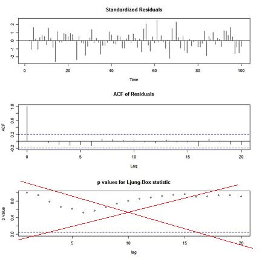

# &#128018;&#128018; R Time Series Issues &#128018;&#128018;


### Table of Contents
* [the end of R will not be messy ... it will be tidy](#issue---how-will-r-end)
* [reproducibility](#issue---reproducibility)
* [when is a matrix not a matrix](#issue---when-is-a-matrix-not-a-matrix)
* [artificially sweetened intelligence](#issue---dont-use-autoarima)
* [when is the intercept the mean](#issue---when-is-the-intercept-the-mean)
* [R you drifting?](#issue---your-arima-is-drifting)
* [wrong p-values](#issue---the-wrong-p-values)
* [lead from behind](#issue---lead-from-behind)
* [regress this](#issue---regression-nightmares)
* [you're ugly](#issue---yu-gi-el-why)
* [don't run this example - or ELSE!](#issue---do-not-run-this-example)

---


&#128018;&#128018;&#128018;&#128018;&#128018; 

We're back at trying to help users get past the gnarly stuff that comes with trying to use R for time series. This is an update of the **R Issues Page** wherein it was written, on whatever they write it on up there: 


> There are a few items related to the analysis of time series with R that will have you scratching your head. The issues mentioned below are meant to help get you past the sticky points. 

Many of these issues have been taken care of in  the package [astsa](https://github.com/nickpoison/astsa).  An introduction to the package may be found at
[FUN WITH ASTSA](https://github.com/nickpoison/astsa/blob/master/fun_with_astsa/fun_with_astsa.md) where the fun never stops.  &#x1F388; &#x1F388; &#x1F388;

* Before we start:

> _Definition:_ &ensp; Vanilla R &ensp; _Packages chosen by the developers that are automatically loaded when R is started._


<br/>

### &#10024; [The Front DooR](https://nickpoison.github.io/) if you need to find your way home.

<br/><br/>

---

### Issue - how will R end?  

---

 The issue below has become a real pain as  the commercial enterprise that makes RStudio  influences the R Foundation, which is a nonprofit organization.  Older folks saw this happen with R's predecessor, S-PLUS.  Anybody using S-PLUS right now?


An  issue with a conflict between the packages  `dplyr`  and  `stats`   (or tidyverse vs noverse)  came to my attention via online complaints; in particular with `filter()` and `lag()`. There may be more conflicts out there, but this conflict can ruin your analyses.  

 The bottom line is, if you are working with time series and you load  `dplyr`, then you should know what it breaks... just be careful.
	

In fact, you should be careful whenever you load a package.  For example:
```r
# if I do this
library(dplyr)

# I will see this 
 Attaching package: 'dplyr' 

 The following objects are masked from 'package:stats': 

     filter, lag     

 The following objects are masked from 'package:base': 

     intersect, setdiff, setequal, union      

## it's a package fight!   
```

How this is allowed is beyond me  no package should be able to annihilate Vanilla R. Perhaps the designers of the tidyverse could have used `dfilter` and `dlag` instead??  (`Filter` is a base script - we used to suggest that as an alternative but we wouldn't want to corrupt a base script, right? )

I would say avoid loading `dplyr` if you're analyzing time series interactively (the advantage of using R vs batch mode programs). And generally, to be safe, load packages consciously and watch for masked objects warnings.

⭐⭐⭐⭐⭐ 

An easy fix if you're analyzing time series (or teaching a class) is to (tell students to) do the following if `dplyr` is being used.

```r
# (1) either detach it
detach(package:dplyr)  

# (2) or fix it yourself if you want dplyr 
# this is a great idea from  https://stackoverflow.com/a/65186251
library(dplyr, exclude = c("filter", "lag"))  # remove the culprits
dlag <- dplyr::lag            # and fix ... 
dfilter <- dplyr::filter      # ... the problems
# then use `dlag` and `dfilter` in dplyr scripts and
# `lag` and `filter` can be use as originally intended

# (3) or just take back the commands
filter = stats::filter
lag = stats::lag

# in this case, you can still use these for dplyr
dlag <- dplyr::lag     
dfilter <- dplyr::filter 

```
&#128534;  If you are wondering how it is possible to corrupt a base package, &#128125; you are not alone. 

⭐⭐⭐⭐⭐

> &#9940; Oh yeah, so you're probably wondering how? ... every package will nullify every other package until one day, you load R and it masks itself in an infinite do loop ...

<br/>


[<sub>top</sub>](#table-of-contents)

<br/>


---
### ISSUE - reproducibility
---

  This is not just a time series complication but a problem for anyone trying to write stable code; i.e., code that not only works today, but also works next Sunday and maybe a year or two from now. The problem is that packages change - R changes 3 times a year.

We've experienced both of the following problems, and it is agitating, agonizing, discomforting, disquieting, distressing, enraging, infuriating, maddening, and just plain  annoying...

<br/>

&#128545; __Contributed Packages:__ For a little side interest, check out the [isoband incident story](https://appsilon.com/cran-and-the-isoband-incident/) where nearly 5000 packages were going to be removed from CRAN because of package dependencies.  


* Here's what happened a long time ago. We used a contributed package in `astsa`.  An update to R broke the package with no easy way to fix the mess.  We had to rewrite 
  a number of scripts to circumvent problem.  
  
*  The advice for these kinds of problems is  try not to rely on other packages if you only need a few items.  Packages are open source, so if you need a script, find the source code at https://github.com/cran/, read the license (&#129315;), take what you need and modify it as necessary or use the script to write your own code, and credit the source.


&#128545;  __Vanilla R:__  

* Recently, we started to work on something we did about a year ago. The code (in Vanilla R) doesn't work anymore and gives several errors.   After awhile, we realized that we did the work using Microsoft R version 4.0 (whereas Vanilla R was at version 4.2).  So we went back to Micro R and voilà, no problems.  We were able to figure out the problems eventually, but it made it much harder to restart the research.  

- Unfortunately, Microsoft R is dead. An alternative, however, Groundhog's R Archive Neighbor [Gran](https://groundhogr.com/gran/) is available. More info [here](https://datacolada.org/108). 


[<sub>top</sub>](#table-of-contents)

<br/>

---

###   ISSUE - when is a matRix not a matRix? 

---

 You have a sequence of matrices, $A_t$, that are of ARBITRARY dimensions $p \times q$  for $t = 1, \dots, n$.  You would use an `array` right?  BUT, and this is a big BUT, the behavior changes with $p$ and $q$.  Let's have a closer look: 

```r
# 3  2x2 matrices
( A = array(diag(1,2), dim=c(2, 2, 3)) )
   , , 1
   
        [,1] [,2]
   [1,]    1    0
   [2,]    0    1
   
   , , 2
   
        [,1] [,2]
   [1,]    1    0
   [2,]    0    1
   
   , , 3
   
        [,1] [,2]
   [1,]    1    0
   [2,]    0    1

is.matrix(A[,,2])
   [1] TRUE  ok - a matrix
```
but
```r
# 3  2x1 matrices 
( B = array(matrix(1,2), dim=c(2, 1, 3)) )
   , , 1
   
        [,1]
   [1,]    1
   [2,]    1
   
   , , 2
   
        [,1]
   [1,]    1
   [2,]    1
   
   , , 3
   
        [,1]
   [1,]    1
   [2,]    1

is.matrix(B[,,2])
   [1] FALSE  WTF? not a matrix
```
and
```r
# 3  1x2 matrices 
( C = array(matrix(2,1), dim=c(1, 2, 3)) )
  , , 1
  
       [,1] [,2]
  [1,]    2    2
  
  , , 2
  
       [,1] [,2]
  [1,]    2    2
  
  , , 3
  
       [,1] [,2]
  [1,]    2    2

is.matrix(C[,,2])
   [1] FALSE  WTF? not a matrix
```

What's happening is if $p$ or $q$ are $1$, then you don't get an array of matrices.
What can go wrong?

```r 
# should be a 2x1 times a 1x2 or 2x2 - BUT IT'S NOT!
B[,,1] %*% C[,,1]
         [,1]
   [1,]    4

# this doesn't work either
as.matrix(B[,,1]) %*% as.matrix(C[,,1])
   Error in as.matrix(B[, , 1]) %*% as.matrix(C[, , 1]) : 
    non-conformable arguments
```
What's the remedy? Use Matlab, or make sure your matrices are the matrices you intended them to be:

```r
# like this
 matrix(B[,,1], 2, 1) %*% matrix(C[,,1], 1, 2)
         [,1] [,2]
   [1,]    2    2
   [2,]    2    2
```

 &#128545; If you're thinking _Well don't use `array` if one of the dimensions is 1_, let me say that the dimensions are arbitrary... meaning if you write a general script, you have to have cases.

<br/>

  But wait ... there's more. A matrix should behave like a matrix, right?  So if $A$ is a $3 \times 3$ matrix, what would happen if you tried to use $A_2$ instead of $A_{2,2}$?  You would say you should get an error on misuse of subscripts to avoid errors in your code.  And you would  be correct, but you are using R ... check it out:

 ```r
( A = matrix(1:9, 3) )
 #      [,1] [,2] [,3]
 # [1,]    1    4    7
 # [2,]    2    5    8
 # [3,]    3    6    9

A[2,2]
# [1] 5     ok 

A[2]
# [1] 2    WTF? this should be an error

str(A)    # what seems to be going on
# int [1:3, 1:3] 1 2 3 4 5 6 7 8 9
 ```

 😱 😱 😱 

 <br/>


[<sub>top</sub>](#table-of-contents)

<br/>


---

### Issue - don't use auto.arima   

---

 Don't use black boxes like `auto.arima` from the `forecast` package because they DON'T WORK.

Here are some related recent stories: 

> [A.I.-Generated Reading List in Chicago Sun-Times Recommends Nonexistent Books](https://www.nytimes.com/2025/05/21/business/media/chicago-sun-times-ai-reading-list.html#:~:text=A.I.%20Job%20Apocalypse-,A.I.-Generated%20Reading%20List%20in%20Chicago%20Sun-Times%20Recommends%20Nonexistent,The%20Philadelphia%20Inquirer%20have%20apologized)
> 
>The summer reading list tucked into a special section of The Chicago Sun-Times and The Philadelphia Inquirer seemed innocuous enough.
> 
>There was just one issue: None of the book titles attributed to those authors were real. They had been created by generative artificial intelligence.

> [New York lawyers sanctioned for using fake ChatGPT cases in legal brief](https://www.reuters.com/legal/new-york-lawyers-sanctioned-using-fake-chatgpt-cases-legal-brief-2023-06-22/)
>
> A U.S. judge on Thursday imposed sanctions on two New York lawyers who submitted a legal brief that included six fictitious case citations generated by an artificial intelligence chatbot, ChatGPT.
>

> [Judge Rules in Favor of School That Gave Student a Bad Grade for Using AI](https://gizmodo.com/judge-rules-in-favor-of-school-that-gave-student-a-bad-grade-for-using-ai-2000528368)
>
> A federal judge has ruled that a Massachusetts school was likely within its rights to discipline a student who used generative artificial intelligence to complete an assignment.
>

> [Stanford Professor Accused of Using AI to Write Expert Testimony Criticizing Deepfakes]((https://gizmodo.com/stanford-professor-accused-of-using-ai-to-write-expert-testimony-criticizing-deepfakes-2000527975))
>
> In what appears to be an embarrassing and ironic gaffe, a top Stanford University professor has been accused of spreading AI-generated misinformation while serving as an expert witness in support of a law designed to keep AI-generated misinformation out of elections.

&#128081; The obvious question in those stories is: _Why wasn't the generated material checked before submission??_ 

&#129300; Another obvious question is _why are you using automated ARIMA fitting?_  If it's because you don't know what you're doing, then how are you going to check the results before submission?  

&#128580; So what's wrong with automated model fitting? Nothing ... if you know what you are doing.  And if you know what you are doing, and you want it to be automated for some reason, then  it's better to fit AR models because:

- the theory is well established and 
- _you don't have to deal with the problem of cancellation of the AR and MA operators (aka parameter redundancy)._  Don't know what that means?? Then don't use automated ARIMA fitting because automated fitting doesn't do this well, if at all (seems to me that programmers don't address this).
- but, then there's still the question of transformations:
   - should you detrend? 
   - should you difference?  
   - should you fractionally difference?  
   - should you apply a variance stabilizing transformation?
   - should you preprocess the data in any way before fitting a stationary model?

If your answers to the above are: "I dunno" then you should know that automated fitting doesn't do this very well either.

&#128532; Well there are tests for some of these things, right??  
   - did you know that if the null hypothesis is true, the p-value is Uniform(0,1).  That means if the null hypothesis is true, the p-value has the same probability of being bigger than .95 than less than .05.   
   - and if you automate a test, you have to choose a cut-off for a decision... do you reject the null if $p \le .05$ ?? well, what if $p=.051$ or $.052$ or ... ??  &#128565;

&#128122; Originally, `astsa` (the first versions written in basic) had automatic fitting of models but IT DIDN'T WORK and was scrapped.  The bottom line is, if you don't know what you're doing, then why are you doing it? Maybe a better idea is to [take a short course on fitting ARIMA models to data](https://www.datacamp.com/courses/arima-models-in-r).  It's really not that hard.

&#129335; But what if I want to let a machine do it?  Well, you're better off fitting long ARs and try to deal with transformations in a smart way... at least you don't have to check (approximate) overparameterization.

&#128055; Here's a simple example of automated ARIMA fitting to white noise:

```r
set.seed(666)
x = rnorm(1000)          # WHITE NOISE 
forecast::auto.arima(x)  # BLACK BOX

   # partial output
     Series: x
     ARIMA(2,0,1) with zero mean

     Coefficients:
               ar1      ar2     ma1
           -0.9744  -0.0477  0.9509
     s.e.   0.0429   0.0321  0.0294

     sigma^2 estimated as 0.9657:  log likelihood=-1400
     AIC=2808.01   AICc=2808.05   BIC=2827.64
```

 HA! ... an ARMA(2,1) ??  

&#x1F439; But if you know what you're doing, you would realize the model that the `auto.arima` fit is overparameterized white noise. 

&#128038;  The bottom line here is, in it's present state, automated ARIMA model fitting is for the birds. &#128038;

&#128520; So  let's see what happens if we just fit ARs using AIC 

```r
# we're going to use 'spec.ic' is from 'astsa'  
library(astsa)

set.seed(666)       # same as above
x = rnorm(1000)       
u = spec.ic(x)      # plot below

# to see the AICs and BICs (the min is sutracted so the min order is easy to find)
u[[1]]

     ORDER   AIC    BIC
         0  0.00   0.00
         1  1.23   6.14
         2  3.16  12.97
         3  4.72  19.45
         4  6.18  25.81
         5  5.38  29.92
         .   .      .
        28 23.69 161.10
        29 24.60 166.93
        30 21.27 168.51
```
... it's WHITE NOISE, dingus.


<br/>

&#129303; Here's another one from the _Time Series: A Data Analysis Approach_ text.  Remember `cmort`, it's weekly cardiovascular mortality in LA for a decade.  

```r
# first, using only 2% of our brain we find an ARIMA(1,1,0) model fits well ... 
# it's Example 4.31 in the text if you want details:
sarima(cmort, 1,1,0)   

# output
  Coefficients:
           Estimate     SE  t.value p.value
  ar1       -0.5064 0.0383 -13.2233  0.0000
  constant  -0.0263 0.1715  -0.1533  0.8782

 sigma^2 estimated as 33.809 on 505 degrees of freedom
 AIC = 6.371023  AICc = 6.37107  BIC = 6.396044 
```

<br/>

&#129320; Using `auto.arima` (which takes forever and gets my cpu fan racing)

```r
forecast::auto.arima(cmort)

# output
  ARIMA(2,0,2)(0,1,0)[52] with drift

  Coefficients:
           ar1     ar2      ma1     ma2    drift
        0.5826  0.0246  -0.3857  0.2479  -0.0203
  s.e.  0.3623  0.3116   0.3606  0.2179   0.0148  <- SEs are huge!!

 sigma^2 = 56.94:  log likelihood = -1566.28
 AIC=3144.57   AICc=3144.76   BIC=3169.3  
```

The final model is ARIMA $(2,0,2) \times (0,1,0)_{52}$. __NONE__ of the parameters are significant at any reasonable level and the estimated standard errors are very large. And by seasonal differencing (which is NOT needed, you've lost more than 10% of the data).

&#128527; AIC, AICc, and BIC (comparable to the `astsa` output) are all worse than the use your brain model:
```r
AIC = 6.895983  AICc = 6.896275  BIC = 6.950226  <- auto (arima)  
AIC = 6.371023  AICc = 6.37107   BIC = 6.396044  <- brain (arima)
```

Also, you can specify the option to do an all subsets `auto.arima` - but for some reason, that's worse than the stepwise (don't ask me??) 

&#129320; Wait a second... we're not done because everyone knows you should do a residual analysis. Right? Right!  First, the simple model:

<br/>
That's nice ... maybe a little annual behavior still there, but small.

<br/>

Now let's look at the `auto.ascreama` residual analysis... look out below!

<br/>
Ugly- isn't it?

<br/>
nuff said...

[<sub>top</sub>](#table-of-contents)

<br/>


---

### Issue - when is the intercept the mean?   

---


 When fitting ARMA models, Vanilla R calls the estimate of the mean, the estimate of the intercept. This is ok if there's no AR term, but not if there is an AR term.

For example, if $x_t = \alpha + \phi x_{t-1} + w_t$ is stationary, then taking expectations, with $\mu = E(x_t)$, we have $\mu = \alpha + \phi \mu$ or 

$$\alpha = \mu (1-\phi).$$


 So, the intercept, $\alpha$  is not the mean, $\mu$, unless $\phi = 0$. In general, the mean and the intercept are the same only when there is no AR term. Here's a numerical example:

```r
# generate an AR(1) with mean 50
set.seed(666)      # so you can reproduce these results
x = arima.sim(list(ar=.9), n=100) + 50
# in astsa it's
# x = sarima.sim(ar=.9, n=100) + 50 

mean(x)  
  [1] 49.09817   # the sample mean is close

arima(x, order = c(1, 0, 0))  
  Coefficients:
           ar1  intercept   # <--  here is the problem
        0.7476    49.1451   # <--  or here, one of these has to change
  s.e.  0.0651     0.3986
````

The result is telling you the estimated model is something like

$$ x_t = 49 + .75 x_{t-1} + w_t$$

whereas, it should be telling you the estimated model is

 $$ x_t - 49 = .75 ( x_{t-1} - 49 ) + w_t $$

or

$$ x_t  = 12.25 + .75  x_{t-1}  + w_t $$


&#129300; And if $12.25$ is not the intercept, then what is it??

The easy thing (for the R devs) to do is simply change "intercept" to "mean":

```r
  Coefficients:
           ar1       mean  # <-- easy  
        0.7476    49.1451
  s.e.  0.0651     0.3986
```

 This is the main reason `sarima` in the package [`astsa`](https://github.com/nickpoison/astsa) was developed, and frankly, to make up for the fact that time series was an afterthought, started the entire [`astsa`](https://github.com/nickpoison/astsa) package in the first place.
 Here it is for your pleasure:

 ```r
 sarima(x,1,0,0)

# partial output

    $ttable
          Estimate     SE  t.value p.value
    ar1     0.7476 0.0651  11.4835       0
    xmean  49.1451 0.3986 123.3091       0
 ```

[<sub>top</sub>](#table-of-contents)

 <br/>

 

---

### Issue - your arima is drifting 

---


 When fitting ARIMA models with Vanilla R, a constant term is NOT included in the model if there is any differencing. The best Vanilla R will do by default is fit a mean if there is no differencing [type `?arima` for details].

What's wrong with this?  Well (with a time series in `x`), for example:
```r
arima(x, order = c(1, 1, 0))          # (1)
```
will not produce the same result as
```r
arima(diff(x), order = c(1, 0, 0))    # (2)
```
because in (1), Vanilla R will fit the model [with $\nabla x_s = x_s - x_{s-1}$]

$$ \nabla x_t= \phi \nabla x_{t-1} + w_t \quad {\rm (no\ constant)} $$

whereas in (2), Vanilla R will fit the model 

$$ \nabla x_t=  \alpha + \phi \nabla x_{t-1} + w_t \quad {\rm (constant)} $$


If there's drift (i.e., $\alpha$ is NOT zero), the two fits can be extremely different and using (1) will lead to an incorrect fit and consequently bad forecasts. 

If  $\alpha$  is NOT zero, then what you have to do to correct (1) is use `xreg` as follows:

```r
arima(x, order = c(1, 1, 0), xreg=1:length(x))    # (1+)
```


If you want to see the differences, generate a random walk with drift and try to fit an ARIMA(1,1,0) model to it.  Here's how:

```r
set.seed(1)           # so you can reproduce the results
v = rnorm(100,1,1)    # v contains 100 iid N(1,1) variates
x = cumsum(v)         # x is a random walk with drift = 1 

## (1)
arima(x, order = c(1, 1, 0))   # yes! it's a mess!  
#  Coefficients:
#           ar1
#        0.6031
#  s.e.  0.0793

## (2)
arima(diff(x), order = c(1, 0, 0))   
#  Coefficients:
#            ar1  intercept
#        -0.0031     1.1163
#  s.e.   0.1002     0.0897

## (1+)
arima(x, order = c(1, 1, 0), xreg=1:length(x))     
#  Coefficients:
#            ar1  1:length(x)
#        -0.0031       1.1163
#  s.e.   0.1002       0.0897
```

 Let me explain what's going on here. The model generating the data is  

$$ x_t = 1 + x_{t-1} + w_t $$

where $w_t$ is standard normal  noise.  Another way to write this is 


$$    x_t - x_{t-1}  = 1 + 0 (x_{t-1} - x_{t-2}) + w_t $$

or

$$ \nabla x_t = 1 + 0 \nabla x_{t-1} + w_t . $$

If you fit an AR(1) to $\nabla x_t$ [aka `diff(x)`], the estimates should be, approximately, `ar1 = 0` and `intercept = 1`.  
     
Thus (1) gives the WRONG answer because it's forcing the regression through the origin. The others are correct.

Why does (1+) work?  In symbols,   `xreg = t`  and consequently,  Vanilla R will replace  $x_t$   with  $y_t = x_t - \beta t$  ;
that is, it will fit the model

$$\nabla y_t =   \phi  \nabla y_{t-1} + w_t,$$

or

$$ \nabla [x_t - \beta t] =   \phi  \nabla [x_{t-1} - \beta (t-1)] + w_t. $$ 

Simplifying, 

$$ \nabla x_t = \alpha +  \phi \nabla x_{t-1} + w_t , $$

where   $\alpha =  \beta (1-\phi)$.

&#128054;  S-PLUS didn't address the possibility that a time series would have drift.  The R folks continued that mistake (mistakes propagate) because signal processing was an after-thought in S-PLUS that propagated to R.   This oversight is easy to correct, why it isn't  corrected is a mystery.   

&#127881; The bottom line here is, if you wanna be happy for the rest of your life, don't use Vanilla R for time series analysis.  Instead, reach for a package like [astsa](https://github.com/nickpoison/astsa)  that will set you free.  &#127882;

```r 
sarima(x,1,1,0)

# partial output
    $ttable
             Estimate     SE t.value p.value
    ar1       -0.0031 0.1002 -0.0308  0.9755
    constant   1.1163 0.0897 12.4465  0.0000
```


[<sub>top</sub>](#table-of-contents)

<br/>


---

### Issue - the wrong p-values 

---

 If you use Vanilla R's `tsdiag` for diagnostics after an ARIMA fit, you will get a graphic that looks like this: 




&#129337;&#127995; The p-values shown for the Ljung-Box statistic plot are incorrect because the degrees of freedom used to calculate the p-values are `lag` instead of `lag - (p+q)`. That is, the procedure being used does NOT take into account the fact that the residuals are from a fitted model.  This is corrected in `sarima` in  [`astsa`](https://github.com/nickpoison/astsa).

[<sub>top</sub>](#table-of-contents)

<br/>


---

### Issue - lead from behind 

---


 You have to be  careful when working with lagged components of a time series. Note that `lag(x)` is a FORWARD shift and `lag(x,-1)`  is a BACKWARD shift (unless you happen to load `dplyr`).


Try a small example:

```r
x = ts(1:5)
cbind(x, lag(x), lag(x,-1))
 
  Time Series:
  Start = 0 
  End = 6 
  Frequency = 1 
  
      x lag(x) lag(x, -1)
  0  NA     1         NA
  1   1     2         NA
  2   2     3          1
  3   3     4          2 ## in this row, x is 3, lag(x) is 4, lag(x,-1) is 2
  4   4     5          3               
  5   5    NA          4
  6  NA    NA          5
```

In other words,  if you have a series $x_t$  then 

$$  y_t = {\rm lag}\{x_t\} = x_{t+1} $$

 and NOT  $x_{t-1}$.  In fact, this is reasonable in that $y_t$ actually does "lag" $x_t$ by one time period. But, it seems awkward, and it's not typical of other programs. As long as you know the convention, you'll be ok (unless you happen to load `dplyr`).

 &#128031; This plays out in many things with Vanilla R. For example, here's a _lag plot_ of the Southern Oscillation Index ($S_t$) series.  It looks like scatterplots of  $S_{t-k}$ (horizontal axis) vs $S_t$ (vertical axis),  but in fact, are plots of  $S_{t+k}$ vs $S_t$, for $k=1,\dots,4$.

```r
lag.plot(soi, 4,  col=4)
```


<br/>

&#128032;  There are two _lag plot_ scripts in `astsa`, here's the (similar) one for one series. You get what you think you were getting in the plot above.  And by default, you get a lowess fit (red line) and the sample ACF (top right).

```r
lag1.plot(soi, 4, col=4) 
```


 [<sub>top</sub>](#table-of-contents)


 <br/>

---

### Issue - regression nightmares 

---

 This is something you outta know.  Although Vanilla R does warn you about this, it's easy to miss.  This is from the help file `?lm` near the end

> **Using time series** <br/>
Considerable care is needed when using `lm` with time series.

If you are using `lm()` with time series, be sure to read the entire warning.  We'll just focus on one big problem via a little Vanilla R example.

```r
set.seed(666)
y = 5 + arima.sim(list(order=c(1,0,0), ar=.9), n=20)  # 20 obs from an AR(1) with mean 5
# in astsa it's
# y = 5 + sarima.sim(ar=.9, n=20)

# let's try to fit the regression using lm()

# first the regressor
x = lag(y,-1)
##  you wouldn't regress y on lag(y) because that would be progress  ;-) 

# run the regression
lm(y ~ x)

   Coefficients:
    (Intercept)            x  
              0            1  
```
Perfect fit: $\hat y = x$ or $\hat x_t = x_{t-1}$.  

But wait, we know $\hat x_t -5 =  .9 (x_{t-1}-5)$ or $\hat x_t = .5 + .9 x_{t-1}$... must be a mistake.

The problem is that $x_t$ and $x_{t-1}$ aren't aligned, so they look the same to Vanilla R. The remedy to is align them this way:

```r
dog = ts.intersect(y, x)  # aligns y and x on time
# the regession will work now
lm(y ~ x, data=dog)
 
  Coefficients:
   (Intercept)            x  
        1.1011       0.7659 
```
By the way, (Intercept) is used correctly here.

&#128061; The bottom line for this one is, if `x` is a time series, `x` and `lag(x,-1)` [and any other version `lag(x, k)` for any integer `k` for that matter] are perfectly correlated unless you align them first.  

&#129315; Here you go

```r
x1 = rnorm(100)
cor(cbind(x1, x2=lag(x1,-1), x3=lag(x1,3)))

# the correlation matrix (all 1s)
      x1 x2 x3
   x1  1  1  1
   x2  1  1  1
   x3  1  1  1
```


This can be a pain if you want to do lagged regressions, say 

$$x_t = \beta_0 + \beta_1 z_{t} + \beta_2 z_{t-1} + w_t $$

because all those series have to be aligned first: `dog = ts.intersect(x, z, lag(z,-1))`. And then if you want to try another lag of `z`, you have to redo `dog`.  Luckily, there is a package called [dynlm](https://CRAN.R-project.org/package=dynlm) that can handle these problems without having to align and re-align. The nice thing is it works like `lm`.


 [<sub>top</sub>](#table-of-contents)


 <br/>

---

### Issue - Yu-Gi-El Why?  

---

 U - G - L - Y ... you ain't got no alibi.  This was one of the first things we took care of in [astsa](https://github.com/nickpoison/astsa).  When you're trying to fit an ARMA model to data, you first look at the sample ACF and PACF of the data. 

Let's try this for a simulated MA(1) process. Here's how
```r
MA1 = arima.sim(list(order=c(0,0,1), ma=.5), n=100)
# in astsa it's
# MA1 = sarima.sim(ma=.5, n=100)
par(mfcol=c(2,1))
acf(MA1,20)
pacf(MA1,20)
```
and here's the output:


What's wrong with this picture? First, the two graphs are on different scales. The ACF axis goes from -.2 to 1, whereas the PACF axis goes from -.2 to .4. Also, the lag axis on the ACF plot starts at 0 (the 0 lag ACF is always 1 so you have to ignore it or put your thumb over it), whereas the lag axis on the PACF plot starts at 1. So, instead of getting a nice picture by default, you get an UGLY messy picture. 

You can fix it up:
```r
par(mfrow=c(2,1))
acf(MA1, 20, xlim=c(1,20))   # set the x-axis limits to start at 1 then
                             #  look at the graph and note the y-axis limits
pacf(MA1, 20, ylim=c(-.2,1)) #   then use those limits here
```

But an easier thing to do is to use `acf2` from the [astsa](https://github.com/nickpoison/astsa) package.

 [<sub>top</sub>](#table-of-contents)


 <br/>

---

### Issue - Do Not Run This Example  

---


 &#10060; After viewing enough help files, you will eventually run into `## Not run:` in an __Examples__ section.  Why would an example be given with a warning NOT to run it?


 `Not run` just tells CRAN not to check the example for various reasons such as it takes a long time to run  ... it sort of runs against the idea that help files should be helpful or at least not make things worse.  _Bottom line: Ignore it._ <font color="#FF4500">It is NOT for a user's consumption.</font> If you are using html help and you see this, then [Run Examples]() will not do anything. In this case, you just copy-and-paste the code to run it (at your own risk of course).


 [<sub>top</sub>](#table-of-contents)

 <br/> <br/>

---
<p style="text-align: center;">&#128018; &Eopf; &#8469; &#120123; &#128018;</p>

---

