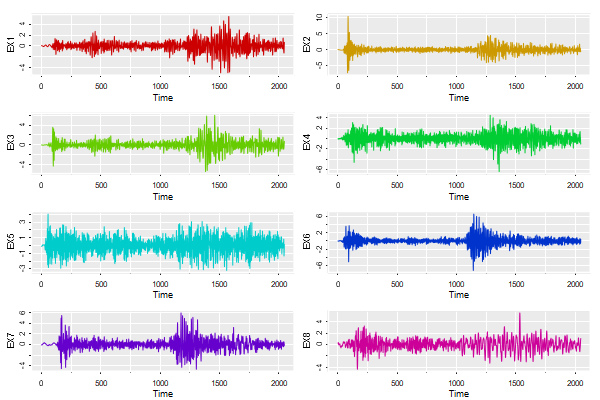

# &#128018;&#128018; Time Series and R Graphics &#128018;&#128018;


This is a resurrection of the _Time Series and Graphics_ page that had been discontinued.  

For this page, we'll use Vanilla R, [astsa](https://github.com/nickpoison/astsa), and [ggplot2](https://CRAN.R-project.org/package=ggplot2). We used to include demonstrations from the `ggfortify` package, but it was changed so often that eventually most of the examples didn't work. There are some examples at the end.


### Table of Contents
* [Part 1 - simple but effective](#part-1---simple-but-effective)
* [Part 2 - two series](#part-2---two-series)
* [Part 3 - many series](#part-3---many-series)
* [Part 4 - missing data](#part-4---missing-data)
* [Part 5 - everything else](#part-5---everything-else)


You'll need two packages to reproduce the examples. All the data used in the examples are from [astsa](https://github.com/nickpoison/astsa).
```r
install.packages(c("astsa", "ggplot2"))
```


&#x1F4A1; You may also want to check out the [Cairo](https://CRAN.R-project.org/package=Cairo)
package to create high-quality graphics.  It's not necessary, but it sure looks nice. The package is built into R, but needs to be loaded (don't we all?) `library(Cairo)`.

<br/>

### &#10024; [The Front DooR](https://nickpoison.github.io/) if you need to find your way home.


<br/><br/>

---
### Part 1 - simple but effective
---

&#128526; First, here's how to plot `gtemp_land` using the base graphics. If you add a grid after you plot, it goes on top. You have some work to do if you want the grid underneath... but at least you can work around that - read on.

```r
# for a basic plot, all you need is
plot(gtemp_land)                    # it can't get simpler than that (not shown)
plot(gtemp_land, type='o', col=4)   # a slightly nicer version (not shown)
                                              
# but here's a pretty version using Vanilla R that includes a grid (not shown)
par(mar=c(2,2,0,.5)+.5, mgp=c(1.6,.6,0))                   # trim the margins       
plot(gtemp_land, ylab='Temperature Deviations', type='n')    # set up the plot
grid(lty=1, col=gray(.9))                                  # add a grid
lines(gtemp_land, type='o', col=4)                         # and now plot the line
```

The reason we're not showing the above is that you can get all that and more with [astsa](https://github.com/nickpoison/astsa).

```r 
# in astsa, it's a one liner
tsplot(gtemp_land, type='o', col=4, ylab='Temperature Deviations')
```


&#x1F535; And a `ggplot2` of the gtemp series. `ggplot2` doesn't play with time series so you have to create a data frame that strips the series to its bare naked data.

```r
gtemp.df = data.frame(Time=c(time(gtemp_land)), gtemp=c(gtemp_land)) # strip the ts attributes
ptemp    = ggplot(data = gtemp.df,  aes(x=Time, y=gtemp) )   +   # store it
                  ylab('Temperature Deviations')             +
                  geom_line(col="blue")                      +
                  geom_point(col="blue", pch=1)
ptemp                                                            # plot it    

# To remove the gray background, run 
ptemp + theme_bw()       # not shown  
```


It's not necessary to store the figure... it's just an example of what you can do.

&#128520; If you like the gray background with white grid lines, you can do a gris-gris plot with `astsa` (the grammar of `astsa` is voodoo)

```r
tsplot(gtemp_land, gg=TRUE, type='o', pch=20, col=4, ylab='Temperature Deviations')
```


[<sub>top</sub>](#table-of-contents)

<br/>

---
### Part 2 - two series
---

&#128125; Time to get a little more complex by plotting two series that touch each other (but in a nice way) on the same plot.  We'll get to the general stuff soon.

&#x1F535; Here's an example of `ggplot` for two time series, one at a time (not the best way for many time series).

```r
gtemp.df    = data.frame(Time=c(time(gtemp_land)), gtemp=c(gtemp_land), gtemp2=c(gtemp_ocean))
ggplot(data = gtemp.df, aes(x=Time, y=value, color=variable )  )             +
              ylab('Temperature Deviations')                                 +
              geom_line(aes(y=gtemp , col='Land Only'),  size=1, alpha=.5)   +
              geom_line(aes(y=gtemp2, col='Ocean Only'), size=1, alpha=.5)   +
              theme(legend.position=c(.1,.85))			  
```


<br/>

&#x1F535;  Now the same idea using `tsplot` from `astsa` with the `spaghetti` option.
There are more examples at [FUN WITH ASTSA](https://github.com/nickpoison/astsa/blob/master/fun_with_astsa/fun_with_astsa.md), where the fun never stops.

```r
tsplot(cbind(gtemp_land,gtemp_ocean), col=astsa.col(c(2,5),.5), lwd=2, gg=TRUE,
          ylab='Temperature Deviations', spaghetti=TRUE)
legend("topleft", legend=c("Land Only","Ocean Only"), col=c(2,5), lty=1, bty="n")
```


<br/>

&#127760;  There may be an occasion when you want the legend on the outer margin. This is one way to do it.  The data are sleep states and number of movements.  

```r
# depending on the dimension of the plot, you may 
#  have to adjust the right margin (9) up or down 
par(xpd = NA, oma=c(0,0,0,9) )  
tsplot(sleep2[[3]][2:3], type='s', col=astsa.col(2:3,.7), spag=TRUE, gg=TRUE)
legend('topright', inset=c(-0.3,0), bty='n', lty=1, col=2:3, legend=c('sleep state',
        'number of \nmovements'))
```


<br/>

&#x1F535;  You'll see how to do this with `ggplot` below.  In the global temperature example above, just leave off the last line:

```r
gtemp.df    = data.frame(Time=c(time(gtemp_land)), gtemp=c(gtemp_land), gtemp2=c(gtemp_ocean))
ggplot(data = gtemp.df, aes(x=Time, y=value, color=variable )  )             +
              ylab('Temperature Deviations')                                 +
              geom_line(aes(y=gtemp , col='Land Only'),  size=1, alpha=.5)   +
              geom_line(aes(y=gtemp2, col='Ocean Only'), size=1, alpha=.5)   
              # theme(legend.position=c(.1,.85))	
```

Here's the `ggplot` code for the sleep data - the first two lines are used because `ggplot` wants the data one way only... it's a recurring theme.

```r
library(reshape)                         # install 'reshape' if you don't have it
df     = melt(sleep2[[3]][,2:3])         # reshape the data frame
minute = rep(1:120, 2)
ggplot(data=df, aes(x=minute, y=value, col=variable)) +
        geom_step(lwd=1, alpha=.7)                    +
        ylab('')                                      + 
        scale_x_continuous(breaks = seq(0,120,by=30))  
# The last line was used to get more meaningful ticks on the time axis.
```


[<sub>top</sub>](#table-of-contents)

<br/>

---
### Part 3 - many series
---

&#x1F535; Let's start with `ggplot2`. We're going to plot the 8 explosion series.

```r
library(reshape)            # install 'reshape' if you don't have it
df   = melt(eqexp[,9:16])   # reshape the data frame
Time = rep(1:2048, 8)
ggplot(data=df, aes(x=Time, y=value, col=variable))   +
     geom_line( )                                     +
     theme(legend.position="none")                    +
     facet_wrap(~variable, ncol=2, scales='free_y')   +
     ylab('')	
```


<br/>

&#129299; Now let's try the same thing with `tsplot`. It's not necessary to make it a gris-gris plot so remove the `gg=TRUE` part if you dare.  You don't have to melt anything.

```r
tsplot(eqexp[,9:16], col=1:8, ncol=2, gg=TRUE)
```


<br/>

&#127752; Let's try that again with rainbow colors:

```r
tsplot(eqexp[,9:16], col=rainbow(8, v=.8), ncol=2, gg=TRUE)
```



<br/>


&#128530; Let's do another `ggplot` with more than 2 series on the same plot. The script does not work with time series so you have to spend some time removing the time series attributes.  You could try `ggfortify`, but we'll hold off until the end for that.

&#128549;  We're going to use 3 series from the LA Pollution study from `astsa`.  The data are weekly time series, so we're removing the attributes first.

```r
mortality    = c(cmort)  # cardiovascular mortality
temperature  = c(tempr)  # termperature
pollution    = c(part)   # particulate pollution
df   = melt(data.frame(mortality, temperature, pollution))
Time = c(time(cmort), time(tempr), time(part))
ggplot(data=df, aes(x=Time, y=value, col=variable)) +
    geom_line( )                                    +
    ylab("LA Pollution Study")
```


<br/>

&#128527;  This is how we would do it using `tsplot`.  The first line takes the `astsa` colors magenta, green, and blue, and makes them a little transparent (alpha=.7). Also, `spaghetti` is shortened to `spag`.

```r
culer = astsa.col(c(6,3,4), .7)
tsplot(cbind(cmort,tempr,part), ylab='LA Pollution Study', col=culer, spag=TRUE)
legend('topright', legend=c('Mortality', 'Temperature', 'Pollution'), 
             lty=1, lwd=2, col=culer, bg='white')

```


[<sub>top</sub>](#table-of-contents)

<br/>


---
### Part 4 - missing data
---

&#128518; In base graphics, it is sooooooo simple and the result is decent (not shown). The data set `blood` has lots of `NA`s.  You need to have points (`type='o'` here) to get the stuff that can't be connected with lines.

```r
plot(blood, type='o', pch=19, main='')   
```

&#128525; Here it is using `astsa`:

```r
# if you leave off the cex=1, the points are too small
tsplot(blood, type='o', col=c(4,6,3), pch=19, cex=1, gg=TRUE)  
```


&#127881; &#127880; Nothing to it! &#127880; &#127881;

<br/>

 So, here it is with `ggplot2`. It works ok, but you get warnings and other frustrations you'll see along the way...

```r
# make a data frame removing the time series attributes
df = data.frame(day=c(time(blood)), blood=c(blood), Type=factor(rep(c('WBC','PLT','HTC'), each=91)) )

# notice that the factor levels of Type are in alphabetical order...
levels(df$Type)           
   [1] "HTC" "PLT" "WBC"

# ... if I don't use the next line, the plot will be in alphabetical order ... 
# ... if I wanted the series in alphabetical order ...
# ... I would have ordered it that way - so I need ...
# ... the next line to reorder them back to the way I entered the data   ...
df$Type = factor(df$Type, levels(df$Type)[3:1])  
 
# any resemblance to the blood work of actual persons, living or dead, is purely coincidental
ggplot(data=df, aes(x=day, y=blood, col=Type))       +
       ylab("Mary  Jane's  Blood  Work")             +   
       geom_line()                                   +
       geom_point()                                  +
       theme(legend.position="none")                 +
       facet_wrap(~Type, ncol=1, scales='free_y')
   
# Danger, Will Robinson! Warning! Warning! NAs appearing! 	   
 Warning messages:
 1: Removed 9 rows containing missing values (geom_path).      
 2: Removed 111 rows containing missing values (geom_point).  
# We're doomed! Crepes suzette! 
```


We're not done.  At least we got the plot after some work and warnings. But notice that the vertical axes have to have a common name.  If you want individual labels (e.g., WBC is measured in 10<sup>3</sup>/&mu;L) then you're in a load of &#128169;&#128169;&#128169;  ... we guess that's not in the grammar of graphics, too.). Anyway, we found this a long time ago if you want to force the matter: [how to plot differently scaled multiple time series with ggplot2](https://gist.github.com/tomhopper/faa24797bb44addeba79).


[<sub>top</sub>](#table-of-contents)

<br/>

---
### Part 5 - everything else
---


&#128047; First, some important packages for time series in R are  [xts]( https://CRAN.R-project.org/package=xts) and [zoo](https://CRAN.R-project.org/package=zoo).  Installing `xts` is enough to get both.

```r
install.packages('xts')  # if you don't have it already
library(xts)             # load it
#
plot(djia$Close, col=4)  # 'djia' is an 'xts' data file in 'astsa' 

```


<br/>

&#x1F535; We should probably give [ggfortify](https://CRAN.R-project.org/package=ggfotify) 
a little space, BUT there are NO guarantees that what you see here will work in the future.

```r
install.packages('ggfortify')  # if you don't have it already
library(ggfortify)             # load it

# all on same plot
autoplot(cbind(Mortality=cmort, Temperature=tempr, Particulates=part), 
           xlab='Time', facets=FALSE, main='LA Pollution')  

# different plots 
autoplot(cbind(Mortality=cmort, Temperature=tempr, Particulates=part), 
            xlab='Time', ylab='LA Pollution', ts.colour = 4)  
```


 AGAIN, note that the order of the series is **alphabetical** and **NOT in the input order**. 


<br/>

&#129414; But here's something in the grammar of graphics, too (`gglot2`) ... a pretty _ribbon_ plot of the Southern Oscillation Index:

```r
cblue = astsa.col(5, .5)  # a little pastel
cred  = astsa.col(6, .5)  # is always refreshing
#
df    = data.frame(Time=c(time(soi)), SOI=c(soi), d=ifelse(c(soi)<0,0,1))
#
ggplot( data=df, aes(x=Time, y=SOI) )                              + 
 geom_ribbon(aes(ymax=d*SOI, ymin=0,  fill = "cool"))              +
 geom_ribbon(aes(ymax=0,  ymin=(1-d)*SOI, fill = "warm"))          +
 scale_fill_manual(name='SST', values=c("cool"=cblue,"warm"=cred)) +
 theme(legend.position=c(.05,.12)) 
```


Well that might be pretty, but it obscures the trend, don't you think?

<br/>

&#128056; If you really want to capture trend, try `trend` from `astsa`.
We're using various options here, a `lowess` fit and a gris-gris plot.


```r
trend(soi, lowess=TRUE, ylab="Southern Oscillation Index",  gg=TRUE)
```


<br/>

&#127871; Here's the above with `ggplot` (remember to strip the attributes):

```r
df = data.frame(Time=c(time(soi)), SOI=c(soi))  	
ggplot( data=df, aes(x=Time, y=SOI) )        +
        geom_line(col=4)                     +
        geom_smooth(col=6)    
```


<br/>


&#129408; Here's a discrete-valued series plotted as a step function. `EQcount` in `astsa` is a count of certain types of earthquakes.

```r
tsplot(EQcount, col=4, type='s')
points(EQcount, pch=21, col=4, bg=6)   # just for kicks, not needed and better without it
```


A `type='h'` instead of `type='s'` looks good too.

<br/>

&#127797; If you did not know this already , with time series, the dimensions of the plot matters.


&#128696; By default, R graphic devices are square (7 by 7 inches), which is generally bad for plotting time series as you will see. I use an `.Rprofile` file in the working directory that
takes care of this:

```r
# graphic windows are 9 by 6 inches by default
grDevices::windows.options(width = 9, height = 6) 

# allows a quick use of Cairo - just cw() before a plot
cw = function(w=9, h=6){Cairo::CairoWin(width = w, height = h)}  
```

This consideration DOES NOT apply if you use RStudio.  If you do use RStudio, you are &#128169;&#128169;&#128169; out of luck.

&#129300; Here's the sunspot series from `astsa` using 2 different window sizes.   In the first plot, you see that the series rises quickly &uarr; and falls slowly &#8600; .  The second (square) plot obscures this fact.

```r
tsplot(sunspotz, type='o', pch=20, col=4)
```


<br/>


&#127812; And finally, a base graphics plot of the sunspot numbers: &#127812;

```r
x      = sunspotz
culer1 = rgb(242, 153, 216, max=255)
culer2 = rgb(208,  73, 242, max=255)
culer3 = rgb( 77, 161, 249, max=255)
culer4 = rgb(  0, 200, 225, max=255)
culer5 = rgb(124, 231, 251, max=255)

par(mar=c(2,2,1,1)+2, mgp=c(3,.2,0), las=1, cex.main=2, tcl=0, col.axis=culer1, bg=rgb(.25,.1,.25))
plot(x, type='n', main='', ylab='', xlab='')
rect(par("usr")[1], par("usr")[3], par("usr")[2], par("usr")[4], col='black')
grid(lty=1, col=rgb(1,0,1, alpha=.5))
lines(x,                     lwd=3, col=culer1)
lines(window(x, start=1800), lwd=3, col=culer2)
lines(window(x, start=1850), lwd=3, col=culer3)
lines(window(x, start=1900), lwd=3, col=culer4)
lines(window(x, start=1950), lwd=3, col=culer5)
title(expression('Psychedelic' * phantom(' Sunspots')), col.main=culer1) 
title(expression(phantom('Psychedelic') * ' Sunspots'), col.main=culer5) 
mtext('Time', side=1, line=2, col=culer3, font=2, cex=1.25)
mtext('Sunspot Numbers', side=2, line=2, col=culer2, font=2, las=0, cex=1.25)
text(1800, 180, "don't stare at the sunspots", col=culer5, srt=20, font=4)
text(1900, 170, "s.t.a.y  c.o.o.l", col=culer1, srt=330, font=4)
text(1850, 160, "dave? dave? \n dave's not here!", col=culer3, font=4)
```


[<sub>top</sub>](#table-of-contents)

<br/>
<br/>

---
<p style="text-align: center;">&#128018; &Eopf; &#8469; &#120123; &#128018;</p>

---

<br/>